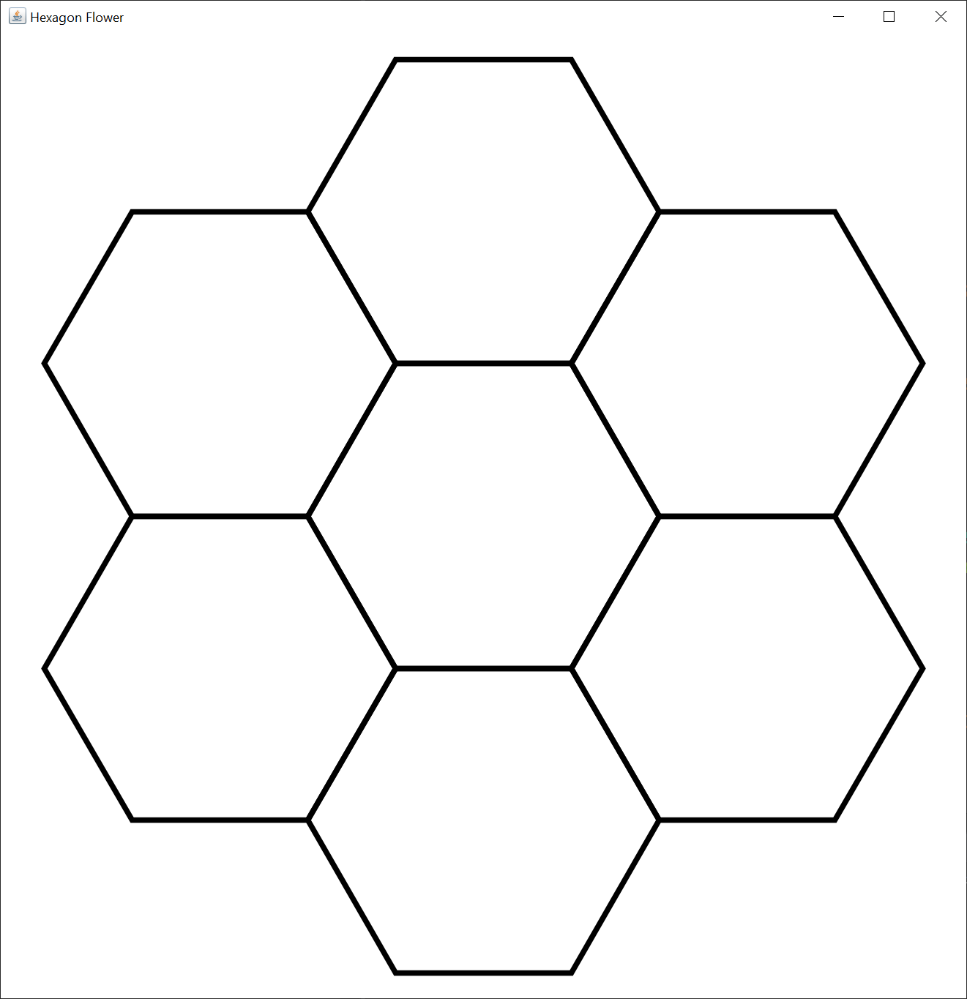

# Hexagon Flower

Recently on Stack Overflow, I came across an interesting question that was closed before I had a chance to see it.

Basically, the OP was asked to draw a hexagon flower like the one I created.

This idea is useful when you want to draw a hexagon map for a game.

I created a basic Swing GUI with a `JFrame` and a drawing `JPanel` to display the flower.  In the drawing `JPanel`, I created two methods.  The first method, the `calculateHexagon` method, calculates a hexagon from an x, y center point and a radius.

The second method, the `calculatePoint` method, calculates a `Point2D` based on the x, y center point, the radius, and the angle from the center point in degrees.  Because the y value on a Swing drawing `JPanel` goes downward, the degrees circle the center point clockwise.

Calculating where the six hexagons that make up the flower petals turned out to be the hardest part.  The formula for finding the hypotenuse of an isosceles triangle is `2 * radius - cosine(theta)`, where theta is the equivalent of 30 degrees expressed in radians.
